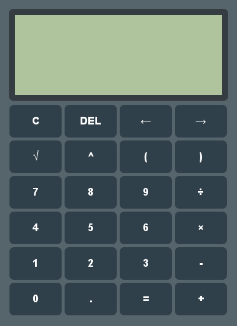

# Scientific Calculator

A sophisticated calculator application built with Java Swing, providing powerful computational capabilities with an elegant and intuitive user interface.

## Features

- **Modern UI Design**: Clean, minimalist interface with retina-style display and custom-rendered components
- **Advanced Scientific Operations**: 
  - Square root, exponents, and parentheses for complex expressions
  - Precise floating-point arithmetic
  - Complete expression parsing with operator precedence
- **Intuitive Expression Editing**:
  - Full cursor navigation for precise input positioning
  - Continuous calculation support
  - Expression history tracking
- **Error Protection**: Robust error handling for invalid mathematical expressions
- **Keyboard Functionality**: Use keyboard input alongside button interface

## Technical Architecture

This application implements a modular design based on the MVC pattern:

- **Model**: `CalcLogic` handles all mathematical operations and expression evaluation
- **View**: `Display` and `CalcUI` manage the visual presentation
- **Controller**: `CalcButtonHandler` processes user input and coordinates updates

### Implementation Details

- **Java Swing UI Framework**: Custom rendering for all UI components
- **Advanced Graphics**: Anti-aliased rendering with custom button states
- **Real-time Expression Parsing**: Dynamic expression evaluation
- **Custom Component Design**: Specially designed display with cursor control

## Development

Built with Java SE and Swing, requiring no external dependencies. The application demonstrates implementation of:

- Custom component rendering
- Expression parsing algorithms
- Event-driven architecture
- UI/UX best practices